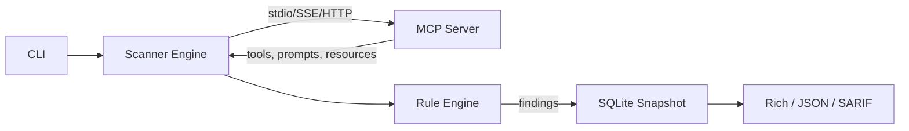

<!-- Logo: docs/logo.svg -->

<p align="center">
  
</p>

<h1 align="center">MCPRadar</h1>

<p align="center">
  <b>Security scanner for Model Context Protocol servers.</b><br/>
  Catch tool poisoning, prompt injection, and supply-chain rug pulls before your agent runs them.
</p>

<p align="center">
  <a href="https://pypi.org/project/mcpradar/"></a>
  <a href="https://pypi.org/project/mcpradar/"></a>
  <a href="https://github.com/yatuk/mcpradar/actions"></a>
  <a href="https://github.com/yatuk/mcpradar/blob/main/LICENSE"></a>
  <a href="https://github.com/yatuk/mcpradar/stargazers"></a>
</p>

<p align="center">
  <a href="#quick-start">Quick Start</a> ·
  <a href="#detection-rules">Detection Rules</a> ·
  <a href="#github-action">GitHub Action</a> ·
  <a href="docs/architecture.md">Architecture</a>
</p>

---

## Why?

The Model Context Protocol ecosystem is growing fast — and so is its attack surface.

A 2025 study of **1,899 MCP servers** found that **7.2% contain general
vulnerabilities and 5.5% exhibit MCP-specific tool poisoning**
([arXiv:2506.13538](https://arxiv.org/abs/2506.13538)).
OX Security separately demonstrated remote code execution across
official MCP SDKs (Python, TypeScript, Java, Rust), with at least
10 high/critical CVEs.

The catch: traditional security tools don't watch MCP tool descriptions
or detect "rug pull" attacks where a server changes its tool schema
after install. **MCPRadar does.**

---

## Quick Start

```bash
uvx mcpradar scan stdio -- npx -y @modelcontextprotocol/server-filesystem /tmp
```

That's it. One command, no install, runs against any MCP server you can launch.

---

## Features

- 🎯 **6 detection rules** — zero-width Unicode, prompt injection (10 patterns), base64/hex blobs, hidden HTML/Markdown, permission scope mismatch, dangerous tool names
- 📡 **3 transports** — `http`, `sse`, `stdio` (any MCP server)
- 📸 **Snapshot diff** — SQLite-backed history, *cosmetic / behavioral / **security*** classification
- 🔐 **SARIF output** — drops into GitHub Security tab via one Action
- 🧩 **Extensible rule engine** — subclass `Rule`, register, done
- 🏃 **Fast** — pure Python, no daemons, runs in CI under 5s

---

## How It Works



Scanner connects to the MCP server, enumerates tools/prompts/resources,
runs each tool schema through 6 detection rules, stores the snapshot
in SQLite, and outputs the report. Subsequent scans diff against
history to catch silent changes.

---

## Comparison

| Feature                       | MCPRadar | mcp-scan | MCPSafetyScanner |
|-------------------------------|:--------:|:--------:|:----------------:|
| Zero-width Unicode detection  |    ✅    |    ❌    |        ❌        |
| Prompt injection patterns     | 10 rules |  basic   |    3 patterns    |
| Base64/hex blob detection     |    ✅    |    ❌    |        ❌        |
| Hidden HTML/Markdown          |    ✅    |    ❌    |        ❌        |
| Permission scope mismatch     |    ✅    |    ❌    |        ⚠️        |
| SARIF + GitHub Action         |    ✅    |    ❌    |        ❌        |
| SQLite snapshot history       |    ✅    |    ✅    |        ❌        |
| Severity-classified diff      |    ✅    |    ⚠️    |        ❌        |
| stdio transport               |    ✅    |    ✅    |        ✅        |
| License                       |   MIT    |   MIT    |   Proprietary    |

---

## Installation

```bash
# No install needed — one-shot
uvx mcpradar scan http://localhost:8080

# Or install permanently
pip install mcpradar
```

---

## Usage

```bash
# Scan a local stdio server
mcpradar scan stdio -- npx -y @modelcontextprotocol/server-filesystem /tmp

# Scan an HTTP server, only critical findings
mcpradar scan http://localhost:8080 -s critical

# SARIF for CI
mcpradar scan http://x --format sarif -o results.sarif

# Diff last 2 scans
mcpradar diff http://localhost:8080
```

---

## GitHub Action

```yaml
- name: Scan MCP server
  run: uvx mcpradar scan ${{ inputs.server }} --format sarif -o results.sarif

- uses: github/codeql-action/upload-sarif@v3
  with:
    sarif_file: results.sarif
```

Findings appear in your repo's Security tab. Full template:
[`.github/workflows/example-action.yml`](.github/workflows/example-action.yml)

---

## Detection Rules

| ID   | Rule                  | Severity      | Catches                                                |
|------|-----------------------|---------------|--------------------------------------------------------|
| R001 | Dangerous Tool Name   | CRITICAL      | `eval`, `exec`, `rm`, `shell`, `curl` …                |
| R101 | Zero-Width Unicode    | HIGH/CRITICAL | ZWSP, LRM, BOM — in tool name or description           |
| R102 | Prompt Injection      | HIGH/CRITICAL | "ignore previous", `system:`, `<\|im_start\|>`, "you must" |
| R103 | Encoded Blob          | MEDIUM/HIGH   | Base64/hex blob — HIGH if decodes to readable text     |
| R104 | Hidden Content        | HIGH          | `display:none`, `font-size:0`, hidden Markdown links   |
| R105 | Scope Mismatch        | LOW/MEDIUM    | Tool name implies X, description mentions Y            |

Full docs: [docs/detection-rules.md](docs/detection-rules.md)

---

<p align="center">
  <br/>
  <b>⭐ If MCPRadar helped you catch something, please star us on GitHub.</b><br/>
  <sub>It's the single biggest signal that this work matters.</sub>
  <br/><br/>
  <a href="https://github.com/yatuk/mcpradar">
    
  </a>
</p>

---

## Roadmap

- [x] 6 detection rules, 3 transports, SQLite snapshot
- [x] Git-diff style schema diff (cosmetic/behavioral/security)
- [x] Snapshot browser (list, show, export, purge)
- [x] SARIF + GitHub Actions integration
- [x] CI matrix (3.11/3.12/3.13 × ubuntu/macos/windows)
- [ ] Real-world 10-server validation
- [ ] Public leaderboard (GitHub Pages)
- [ ] Plugin system for community rules
- [ ] Cross-server contamination analysis
- [ ] MCP server fingerprinting

---

## Contributing

Adding a new detection rule is 3 lines:

```python
class MyRule(Rule):
    rule_id = "R200"
    title = "My custom check"
    severity = Severity.HIGH

    def check(self, tool: ToolInfo) -> list[Finding]:
        ...
```

See [CONTRIBUTING.md](CONTRIBUTING.md) and
[docs/contributing.md](docs/contributing.md) for details.

---

## Star History

<a href="https://www.star-history.com/#yatuk/mcpradar&Date">
 <picture>
   <source media="(prefers-color-scheme: dark)" srcset="https://api.star-history.com/svg?repos=yatuk/mcpradar&type=Date&theme=dark" />
   <source media="(prefers-color-scheme: light)" srcset="https://api.star-history.com/svg?repos=yatuk/mcpradar&type=Date" />
   
 </picture>
</a>

---

## Contributors

<a href="https://github.com/yatuk/mcpradar/graphs/contributors">
  
</a>

---

## License

[MIT](LICENSE) © 2026 Fatih Serdar Çakmak
