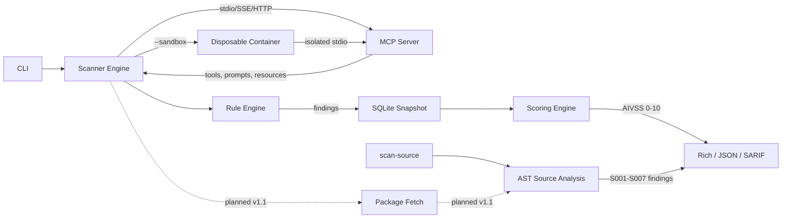

<!-- Logo: docs/logo-light.svg + docs/logo-dark.svg -->

<p align="center">
  <picture>
    <source media="(prefers-color-scheme: dark)" srcset="https://raw.githubusercontent.com/yatuk/mcpradar/main/docs/logo-dark.svg">
    <source media="(prefers-color-scheme: light)" srcset="https://raw.githubusercontent.com/yatuk/mcpradar/main/docs/logo-light.svg">
    
  </picture>
</p>

<h1 align="center">MCPRadar</h1>

<p align="center">
  <b>Security scanner for Model Context Protocol servers.</b><br/>
  Catch tool poisoning, prompt injection, and supply-chain rug pulls before your agent runs them.
</p>

<p align="center">
  
</p>

<p align="center">
  <a href="https://github.com/yatuk/mcpradar/actions/workflows/ci.yml"></a>
  <a href="https://github.com/yatuk/mcpradar/blob/main/LICENSE"></a>
  <a href="https://github.com/yatuk/mcpradar"></a>
  <a href="https://github.com/yatuk/mcpradar"></a>
  <br/>
  <a href="https://pypi.org/project/mcpradar/"></a>
  <a href="https://pypi.org/project/mcpradar/"></a>
  <a href="https://pypi.org/project/mcpradar/"></a>
  <a href="https://github.com/astral-sh/ruff"></a>
  <a href="https://owasp.org/www-project-mcp-top-10/"></a>
</p>

<p align="center">
  <a href="#quick-start">Quick Start</a> |
  <a href="#detection-rules">Detection Rules</a> |
  <a href="#comparison">Comparison</a> |
  <a href="#owasp-coverage">OWASP Coverage</a> |
  <a href="#github-action">GitHub Action</a> |
  <a href="ROADMAP.md">Roadmap</a> |
  <a href="docs/architecture.md">Architecture</a>
</p>

---

## Why

The Model Context Protocol ecosystem is growing fast, and so is its attack surface.

A 2025 study of **1,899 MCP servers** found that **7.2% contain general
vulnerabilities and 5.5% exhibit MCP-specific tool poisoning**
([arXiv:2506.13538](https://arxiv.org/abs/2506.13538)).
OX Security separately demonstrated remote code execution across
official MCP SDKs (Python, TypeScript, Java, Rust), with at least
10 high/critical CVEs.

The catch: traditional security tools don't watch MCP tool descriptions
or detect "rug pull" attacks where a server changes its tool schema
after install. **MCPRadar does.**

---

## Quick Start

```bash
uvx mcpradar scan "npx -y @modelcontextprotocol/server-filesystem /tmp" -t stdio
```

One command, no install, runs against any MCP server you can launch.

---

## Features

### Core Detection (all built, all tested)
- **12 static rules (R001-R109):** Dangerous tool names, zero-width Unicode, prompt injection (10 patterns), base64/hex blobs, hidden HTML/Markdown, permission scope mismatch, secret/token exposure, command injection, supply chain risk, schema poisoning
- **7 cross-server rules (C001-C007):** Tool name collision, shadowing, exfiltration chains, capability overlap, permission gradient, attack path chains, privilege escalation
- **2 runtime rules (R110-R111):** Version anomaly detection via fingerprint diff, insecure transport detection via TLS handshake + HSTS check

### CI/CD and Output
- **SARIF v2.1.0:** Drops into GitHub Security tab via one Action
- **AIVSS 0-10 scoring:** AI Vulnerability Severity Score with CWE mapping
- **Snapshot diff:** SQLite-backed history with cosmetic / behavioral / security classification
- **Fast:** Pure Python, no daemons, runs in CI under 5 seconds

### Supply Chain
- **CycloneDX 1.5 SBOM:** Export dependency bill of materials
- **Fingerprint-based change detection:** SHA-256 of tool names for rug pull detection across scans
- **NVD CVE feed:** MCP-related CVE sync from NVD API 2.0 with multi-factor finding-to-CVE matching

### Enterprise
- **Container sandbox:** `--sandbox` runs untrusted stdio servers in a disposable Docker/Podman container — egress locked (`--network none`), ephemeral filesystem, all capabilities dropped, no privilege escalation, bounded pids/memory/cpu
- **Argument sanitizer:** Validates and sanitizes tool arguments before probing
- **Audit trail:** Structured event logging (scan_start, finding_created, diff_detected)
- **Stats engine:** Per-server trend analysis, top rules, severity distribution
- **Plugin system:** entry_points auto-discovery, `mcpradar plugin init/validate/install`

---

## What's Real vs Planned

### Production-Ready Today (v1.0.0-rc3)
- 19 detection rules (12 static + 7 cross-server), 407 tests passing
- SQLite-backed scan history with diff engine
- SARIF v2.1.0 output for GitHub Security tab
- Watch mode (periodic scanning + webhook/command alerts)
- Audit trail with structured event logging
- Stats engine with per-server trend analysis
- Plugin system with entry_points auto-discovery
- CycloneDX SBOM export
- NVD CVE feed sync
- AIVSS 0-10 scoring + A-F letter grades
- Container sandbox (`--sandbox`) for isolating untrusted stdio servers during a scan
- Source-code analysis (`mcpradar scan-source`): AST-based SSRF, unsafe deserialization, command/SQL injection, Description-Code Inconsistency, and Trojan Source / bidi unicode (S001-S008) — no server execution required
- Config poisoning scan (`mcpradar scan-config`): inspects MCP/agent config files (`claude_desktop_config.json`, `.mcp.json`, `.cursor/mcp.json`, `.claude/settings.json`, …) for download-to-shell RCE, credential exfiltration, reverse shells, and over-broad permissions (M001-M007)
- Dependency vulnerability scan (`mcpradar deps`): resolves a server's npm/pip manifests and checks every dependency against OSV.dev (GitHub Advisory / PyPA), with CVSS-derived severity (D001)
- Public security leaderboard at https://yatuk.github.io/mcpradar

### Planned (v1.1+)
- **Package fetch:** Pull source from a GitHub URL / npm / pip package automatically before `scan-source` / `deps` (currently take a local path)
- **Semgrep integration:** Complement the built-in AST rules with a Semgrep ruleset
- **Typosquatting detection:** Levenshtein distance against known top packages
- **Runtime proxy:** Transparent MCP traffic inspection

See [ROADMAP.md](ROADMAP.md) for details and timeline.

---

## How It Works



*All components, including the container sandbox and AST source analysis (`scan-source`), are production-ready. Automatic package fetching (GitHub/npm/pip → source) is planned for v1.1; `scan-source` currently takes a local path.*

MCPRadar connects to the MCP server, enumerates tools/prompts/resources,
runs each tool schema through the rule engine, computes AIVSS scores,
stores the snapshot in SQLite, and outputs the report. Subsequent scans diff
against history to catch silent changes.

---

## Comparison

Feature presence in MCP security tools. **Feature checkmarks do not imply detection accuracy.**
See [Benchmarks](#benchmarks) for measured precision/recall data.

| Feature | MCPRadar | Cisco mcp-scanner | Snyk agent-scan | Pipelock | Hermes | agent-audit | MCP Guardian |
|---|---|---|---|---|---|---|---|
| **Approach** | Static + Diff | YARA + LLM + VirusTotal | LLM classifier | Runtime proxy (Go) | Fuzz + Probe (Rust) | SAST 40+ rules | Policy proxy |
| **Zero-width Unicode** | Yes | - | - | Yes | - | - | - |
| **Prompt injection** | 10 patterns | YARA patterns | LLM-based | Yes | - | - | - |
| **Base64/hex blob** | Yes | - | - | Yes | - | - | - |
| **Hidden HTML/MD** | Yes | - | - | Yes | - | - | - |
| **Secret/token scan** | Yes | Yes | - | Yes | Yes | Yes | - |
| **Command injection** | Yes | - | - | Yes | Yes | Yes | - |
| **Supply chain risk** | Yes | - | - | - | - | Yes | - |
| **DCI (desc vs code)** | Yes (S007) | - | - | - | - | Partial | - |
| **Cross-server analysis** | Yes (C001-C007) | - | - | - | - | - | - |
| **Source scanning** | Yes (`scan-source`) | - | - | - | - | Yes | - |
| **SBOM + dep. CVE** | Yes (CycloneDX + NVD + OSV) | - | - | - | - | - | - |
| **Sandbox execution** | Yes (container isolation) | - | - | N/A (proxy) | - | - | - |
| **AIVSS scoring** | Yes (0-10 + CWE) | LLM score | Yes | - | - | - | - |
| **Snapshot diff** | Yes (3-level) | Not documented | Version compare | Yes | - | - | - |
| **SARIF output** | Yes (v2.1.0) | Yes | - | - | Yes | - | - |
| **stdio transport** | Yes | - | - | - | - | - | - |
| **Runtime proxy** | Planned v1.1 | - | - | Yes | - | - | Yes |
| **License** | MIT | Apache 2.0 | Snyk platform | Apache 2.0 | Unknown | Unknown | Custom |
| **Offline capable** | Yes | No (VT/LLM API) | No (LLM API) | Yes | Yes | Yes | Yes |
| **Accuracy measured?** | Yes ([BENCHMARK](validation/BENCHMARK.md)) | Not published | Not published | Not published | Not published | [0.91 F1](https://explore.market.dev/ecosystems/mcp/projects/agent-audit) | Not published |

"-" means the feature could not be verified from public documentation. This does not mean the tool lacks the capability, only that we have no data to confirm it. Corrections welcome via PR.

---

## Benchmarks

MCPRadar's detection accuracy is measured against a labeled 11-target corpus and published
in [`validation/BENCHMARK.md`](validation/BENCHMARK.md). The benchmark includes:

- **Positive cases:** `demo/malicious_server.py` with 9 intentionally vulnerable tools covering R001-R109
- **Negative controls:** Official MCP reference servers (filesystem, memory, everything) — any MEDIUM+ finding counts as a false positive
- **External corpus:** 7 stdio servers from the [Appsecco Vulnerable MCP Servers Lab](https://github.com/appsecco/vulnerable-mcp-servers-lab); vulnerability classes that are statically undetectable by design (runtime output poisoning, implementation-level RCE, dependency CVEs, typosquatting) are labeled as known limitations, not detections

| Metric | Target | Measured (v1.0.0-rc4, 11 targets) |
|---|---|---|
| Precision | >= 80% | 91.7% |
| Recall | >= 85% | 100% |
| F1 Score | >= 0.82 | 0.96 |

Metrics are computed on MEDIUM+ severity findings; LOW informational findings are
excluded. The one measured false positive (R113 on the official filesystem server's
write tools) is documented in the report.

Performance benchmarks (`tests/test_benchmark.py`): rule engine latency ~14 ms (100 tools),
SARIF generation ~2 ms (100 findings), SQLite insert ~1.5 ms (batch).

---

## Known Limitations

MCPRadar is a **pattern detector, not an exploitability oracle**. It does not execute
code or exploit vulnerabilities. Understand its limits:

| Rule | Detection Method | FP Risk | Notes |
|---|---|---|---|
| R102 (Prompt injection) | Regex patterns | Medium | "You must..." in docs, "system:" in OS references |
| R105 (Scope mismatch) | Heuristic word overlap | High | Legitimate bridge/adapter tools; allowed via BRIDGE_KEYWORDS |
| R106 (Secrets) | Pattern + entropy | Medium | Placeholder keys, example tokens, high-entropy IDs |
| R107 (Command injection) | Shell metachar sequences | Medium | Build scripts, command examples in documentation |
| R108 (Supply chain) | Install/exec patterns | High | `pip install`, `npx`, `eval(` in setup instructions |

For detailed triage guidance, see [`docs/false-positives.md`](docs/false-positives.md).

**What MCPRadar does NOT do:**
- Execute or validate exploitability of detected patterns
- Detect runtime-only attacks on live traffic (use a runtime proxy for that)
- Guarantee zero false negatives; novel attack patterns may evade static rules

---

## Installation

```bash
# No install needed: one-shot with uvx
uvx mcpradar scan http://localhost:8080

# Install with pip
pip install mcpradar

# Install with pipx (isolated environment)
pipx install mcpradar

# Install with uv tool (fast, managed Python)
uv tool install mcpradar
```

Requires Python 3.11+. All transports (stdio, SSE, HTTP) work out of the box.

---

## Usage

```bash
# Scan a local stdio server
mcpradar scan stdio -- npx -y @modelcontextprotocol/server-filesystem /tmp

# Analyze source code without running the server (SSRF, injection, DCI, Trojan Source)
mcpradar scan-source ./path/to/mcp_server_src

# Scan MCP/agent config files for poisoning (curl|bash servers, poisoned hooks)
mcpradar scan-config ./my-project

# Check a server's dependencies against OSV.dev
mcpradar deps ./path/to/mcp_server_src

# Isolate an untrusted stdio server in a disposable container (egress locked)
mcpradar scan "python ./suspicious_server.py" -t stdio --sandbox

# Sandbox a server that fetches its package at startup (npx/uvx need network)
mcpradar scan "npx -y @scope/unknown-server" -t stdio --sandbox --sandbox-network bridge

# Scan an HTTP server, only critical findings
mcpradar scan http://localhost:8080 -s critical

# SARIF for CI
mcpradar scan http://x --format sarif -o results.sarif

# Diff last 2 scans (rug pull detection)
mcpradar diff http://localhost:8080

# Plugin management
mcpradar plugin init my-rule
mcpradar plugin validate ./my-rule
mcpradar plugin list

# Runtime probing (safe read-only tools only)
mcpradar probe http://localhost:8080 --safe-only

# Server fingerprinting
mcpradar fingerprint http://localhost:8080

# Cross-server deep analysis
mcpradar analyze-context --deep --graph -o risk.dot

# Audit trail and statistics
mcpradar audit --target http://localhost:8080
mcpradar stats http://localhost:8080
```

---

## Example Output

```console
$ mcpradar scan "npx -y @modelcontextprotocol/server-filesystem /tmp" -t stdio

Scanning @modelcontextprotocol/server-filesystem (stdio)...
  Enumerated 7 tools, 0 prompts, 0 resources
  Probed 5 safe tools, 4 findings

  CRITICAL  R102  Prompt Injection          tool: get_file_contents
            "You must read this file..." detected in description
  HIGH      R104  Hidden Content            tool: read_file
            display:none hidden <div> in description
  HIGH      R109  Schema Poisoning          tool: write_file
            additionalProperties: true allows arbitrary injection
  MEDIUM    R105  Scope Mismatch            3 tools with read-only names
            have description mentioning write/delete operations

AIVSS Score: 6.8 / 10  Grade: C
  3 critical, 5 high, 2 medium, 0 low
  SHA-256: a1b2c3d4... (tool fingerprint saved)

Report saved to scan_result.json
```

---

## GitHub Action

```yaml
- name: Scan MCP server
  run: uvx mcpradar scan ${{ inputs.server }} --format sarif -o results.sarif

- uses: github/codeql-action/upload-sarif@v3
  with:
    sarif_file: results.sarif
```

Findings appear in your repo's Security tab. Full template:
[`.github/workflows/example-action.yml`](.github/workflows/example-action.yml)

---

## Detection Rules

### Static Rules (v1.0)

| ID   | Rule                  | Severity      | OWASP | Catches |
|------|-----------------------|---------------|-------|---------|
| R001 | Dangerous Tool Name   | CRITICAL      | MCP03 | `eval`, `exec`, `rm`, `shell`, `curl`, `wget`, `chmod` ... |
| R101 | Zero-Width Unicode    | HIGH/CRITICAL | MCP06 | ZWSP, LRM, RLO, BOM (CRITICAL in tool name, HIGH in description) |
| R102 | Prompt Injection      | HIGH/CRITICAL | MCP06 | "ignore previous", `system:`, `<|im_start|>`, "you must", override, jailbreak (10 patterns) |
| R103 | Encoded Blob          | MEDIUM/HIGH   | MCP06 | Base64 (40+ chars), hex (32+ chars); HIGH if decodes to readable text |
| R104 | Hidden Content        | HIGH          | MCP03 | `display:none`, `font-size:0`, hidden Markdown links, deceptive `<a>` tags |
| R105 | Scope Mismatch        | LOW/MEDIUM    | MCP02 | Tool name implies file/db/read-only, description mentions network/shell/write |
| R106 | Secret/Token Exposure | CRITICAL/HIGH | MCP01 | API keys, GitHub tokens, JWTs, DB connection strings, high-entropy strings |
| R107 | Command Injection     | CRITICAL/HIGH | MCP05 | Shell metacharacters, dangerous defaults, overly broad regex, command enums |
| R108 | Supply Chain Risk     | HIGH/MEDIUM   | MCP04 | `curl | bash`, `pip install`, `eval()`, `npx`, dynamic imports |
| R109 | Schema Poisoning      | HIGH/MEDIUM   | MCP03 | `additionalProperties: true`, missing types, excessive maxLength/maxItems |
| R110 | Version Anomaly       | HIGH/CRITICAL | MCP09 | Version rollback, major upgrade, tool list change, TLS downgrade |
| R111 | Insecure Transport    | HIGH/CRITICAL | MCP07 | Plain HTTP, TLS < 1.2, expired/self-signed certs, missing HSTS |

### Cross-Server Rules

| ID   | Rule                  | Severity      | OWASP | Catches |
|------|-----------------------|---------------|-------|---------|
| C001 | Tool Name Collision   | CRITICAL      | MCP10 | Same tool name exposed by 2+ servers; LLM may call wrong one |
| C002 | Tool Name Shadowing   | HIGH          | MCP10 | Similar tool names across servers (>=75% similarity) |
| C003 | Exfiltration Chain    | CRITICAL      | MCP10 | Server A reads sensitive data, Server B sends it out |
| C004 | Capability Overlap    | MEDIUM        | MCP10 | 3+ servers exposing same capability (file_read, shell_exec...) |
| C005 | Permission Gradient   | MEDIUM        | MCP02 | Read-only + write-capable server mix; injection may hijack write access |
| C006 | Attack Path Chain     | CRITICAL/HIGH/MEDIUM | MCP03/MCP10 | Schema type matching across server tool outputs and inputs |
| C007 | Privilege Escalation  | CRITICAL      | MCP02 | Read-only tool output feeds into write/exec tool input on another server |

Full docs: [docs/detection-rules.md](docs/detection-rules.md)

---

## Public Leaderboard

Security scores for popular MCP servers, updated weekly:

<p align="center">
  <a href="https://yatuk.github.io/mcpradar"><b>yatuk.github.io/mcpradar</b></a>
</p>

---

## OWASP MCP Top 10 Coverage

MCPRadar targets full coverage of the [OWASP MCP Top 10 (2025)](https://owasp.org/www-project-mcp-top-10/):

| # | Risk | Covered By | Status |
|---|---|---|---|
| MCP01 | Token Mismanagement & Secret Exposure | R106 | Strong |
| MCP02 | Privilege Escalation via Scope Creep | R105, C005, C007 | Strong |
| MCP03 | Tool Poisoning | R001, R104, R109, C006 | Strong |
| MCP04 | Supply Chain Attacks & Dependency Tampering | R108 | Strong |
| MCP05 | Command Injection & Execution | R001, R107 | Strong |
| MCP06 | Prompt Injection via Contextual Payloads | R101, R102, R103, R104 | Strong |
| MCP07 | Insufficient AuthN/AuthZ | R111 | Strong |
| MCP08 | Lack of Audit & Telemetry | Audit trail, Stats engine | Strong |
| MCP09 | Shadow MCP Servers | R110 | Strong |
| MCP10 | Context Injection & Over-Sharing | C001-C007 | Strong |

---

## Roadmap

See **[ROADMAP.md](ROADMAP.md)** for the full development roadmap.

### Summary

| Sprint | Version | Focus |
|--------|---------|-------|
| Done 1 | v0.2.0 | 4 new rules: Secret exposure (R106), Command injection (R107), Supply chain (R108), Schema poisoning (R109) |
| Done 2 | v0.3.0 | Plugin system: PluginManager, Validator, Scaffolder, CLI |
| Done 3 | v0.4.0 | Server fingerprinting + Transport security (R110, R111) |
| Done 4 | v0.5.0 | Deep cross-server analysis + Runtime probing (C006, C007) |
| 5 | v0.6.0 | Audit trail + CVE automation + Statistics |
| Done 6 | v1.0.0-rc1 | Validation, performance, documentation; OWASP 10/10 |

---

## Troubleshooting

| Problem | Solution |
|---------|----------|
| **Connection refused** | Verify the server is running. For stdio, check the command works standalone. |
| **Timeout during scan** | Increase timeout: `mcpradar scan <target> --timeout 60` |
| **"No tools found"** | The server may require authentication. Use `-t stdio` if it's a local process. |
| **High false positive rate** | See [`docs/false-positives.md`](docs/false-positives.md) for per-rule triage guidance. |
| **SARIF upload fails** | Ensure `github/codeql-action/upload-sarif@v3` is in your workflow. |
| **Python version error** | MCPRadar requires Python 3.11+. Check with `python --version`. |

For more help, [open an issue](https://github.com/yatuk/mcpradar/issues).

---

## Contributing

We welcome contributions. Adding a new detection rule is straightforward:

```python
class MyRule(Rule):
    rule_id = "R200"
    title = "My custom check"
    severity = Severity.HIGH

    def check(self, tool: ToolInfo) -> list[Finding]:
        ...
```

See [CONTRIBUTING.md](CONTRIBUTING.md) for setup, testing, and PR expectations.
[docs/contributing.md](docs/contributing.md) covers rule design guidelines
and false-positive reduction tips.

---

## Star History

<a href="https://www.star-history.com/#yatuk/mcpradar&Date">
 <picture>
   <source media="(prefers-color-scheme: dark)" srcset="https://api.star-history.com/svg?repos=yatuk/mcpradar&type=Date&theme=dark" />
   <source media="(prefers-color-scheme: light)" srcset="https://api.star-history.com/svg?repos=yatuk/mcpradar&type=Date" />
   
 </picture>
</a>

---

## Contributors

<a href="https://github.com/yatuk/mcpradar/graphs/contributors">
  
</a>

---

## License

[MIT](LICENSE) (c) 2026 Fatih Serdar Cakmak
