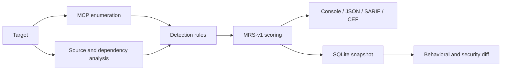

<p align="center">
  <picture>
    <source media="(prefers-color-scheme: dark)" srcset="https://raw.githubusercontent.com/yatuk/mcpradar/main/docs/logo-dark.svg">
    <source media="(prefers-color-scheme: light)" srcset="https://raw.githubusercontent.com/yatuk/mcpradar/main/docs/logo-light.svg">
    
  </picture>
</p>

<h1 align="center">MCPRadar</h1>

<p align="center">
  Security scanner for Model Context Protocol servers.<br>
  Detect tool poisoning, prompt injection, unsafe configuration, vulnerable dependencies,
  and behavioral drift before they reach an agent.
</p>

<p align="center">
  <a href="https://github.com/yatuk/mcpradar/actions/workflows/ci.yml"></a>
  <a href="https://pypi.org/project/mcpradar/"></a>
  <a href="https://pypi.org/project/mcpradar/"></a>
  <a href="LICENSE"></a>
</p>

<p align="center">
  <a href="#quick-start">Quick start</a> ·
  <a href="#capabilities">Capabilities</a> ·
  <a href="#usage">Usage</a> ·
  <a href="#github-actions">GitHub Actions</a> ·
  <a href="#public-leaderboard">Leaderboard</a> ·
  <a href="docs/cli-reference.md">Documentation</a>
</p>

## Overview

MCP servers expose instructions, tools, schemas, resources, and privileged integrations to
AI agents. Security problems in those surfaces are often invisible to conventional package
or network scanners. MCPRadar inspects the protocol surface, source code, configuration, and
software supply chain, then records snapshots so later scans can identify meaningful changes.

A 2025 study of 1,899 MCP servers reported general vulnerabilities in 7.2% of servers and
MCP-specific tool poisoning in 5.5% ([arXiv:2506.13538](https://arxiv.org/abs/2506.13538)).
MCPRadar is designed to make this class of risk reviewable in local development and CI.

## Quick start

Scan a running HTTP MCP server without installing MCPRadar:

```bash
uvx mcpradar scan http://localhost:8080
```

Install the CLI for repeated use:

```bash
uv tool install mcpradar
mcpradar --help
```

Python 3.11 or newer is required. `pip install mcpradar` is also supported.

## Capabilities

| Area | What MCPRadar provides |
|---|---|
| MCP inspection | Cursor-aware enumeration of tools, prompts, resources, templates, and server instructions |
| Detection | Versioned rule catalog for poisoning, injection, schema abuse, secret exposure, transport issues, and cross-server attack paths |
| Source analysis | Python and JavaScript/TypeScript analysis for SSRF, unsafe deserialization, command and SQL injection, Trojan Source, and description-code inconsistency |
| Configuration | Detection of poisoned MCP/agent configuration, hooks, over-broad permissions, and suspicious package names |
| Supply chain | Package fetching without install scripts, OSV dependency checks, CycloneDX SBOM output, hashes, and provenance |
| Change monitoring | SQLite snapshots, tool fingerprints, and cosmetic/behavioral/security diff classification |
| CI and policy | JSON, SARIF, CEF, policy-as-code gates, suppressions, and deterministic signed snapshots |
| Isolation | Disposable Docker/Podman sandbox for untrusted stdio servers with bounded CPU, memory, processes, and output |

The generated [detection rule catalog](docs/detection-rules.md) is the authoritative list of
rules and severity mappings.

## Security model

MCPRadar treats server packages and responses as untrusted input.

- Stdio commands are denied unless `--sandbox` is selected or the caller explicitly opts into
  host execution with `--allow-host-exec`.
- Sandbox runs use a disposable, non-root container with a read-only root filesystem, dropped
  capabilities, bounded resources, and no host mounts.
- Package-reference source scans download and inspect archives without running package install
  scripts or server code.
- Remote fetches enforce URL, redirect, size, timeout, and private-network protections.
- Schema walking, pagination, plugin execution, and output collection are bounded.

When a package must be downloaded at container startup, `--sandbox-network bridge` can be used
explicitly. This grants that container network access and should be reserved for reviewed
packages. See [CLI reference](docs/cli-reference.md) for isolation details.

## Usage

```bash
# Scan an HTTP server
mcpradar scan http://localhost:8080

# Scan a local stdio server in a disposable container
mcpradar scan "python ./server.py" -t stdio --sandbox

# Scan an npm-launched server whose container needs package-download access
mcpradar scan "npx -y @scope/server" -t stdio --sandbox \
  --sandbox-network bridge --allow-unrestricted-egress

# Analyze source without running it
mcpradar scan-source ./path/to/server

# Inspect MCP and agent configuration
mcpradar scan-config ./my-project

# Check a published package and its dependencies
mcpradar deps npm:@modelcontextprotocol/server-filesystem

# Compare the latest snapshots
mcpradar diff http://localhost:8080

# Produce SARIF for CI
mcpradar scan http://localhost:8080 --format sarif -o mcpradar.sarif
```

See the [CLI reference](docs/cli-reference.md) for fingerprinting, runtime probes, cross-server
analysis, policies, plugins, audit events, and statistics.

## How it works



MCPRadar Risk Score (MRS-v1) is a versioned 0–10 project-specific risk signal. It combines
findings, confidence, server capability, dependency risk, and scan coverage. It is not an
exploitability guarantee or a substitute for manual review. See the
[scoring model](docs/scoring-model.md) for the formula and interpretation.

## GitHub Actions

```yaml
- name: Scan MCP server
  run: uvx mcpradar scan http://localhost:8080 --format sarif -o mcpradar.sarif

- name: Upload SARIF
  uses: github/codeql-action/upload-sarif@v3
  with:
    sarif_file: mcpradar.sarif
```

The complete example is available at
[`.github/workflows/example-action.yml`](.github/workflows/example-action.yml).

## Public leaderboard

The [MCPRadar leaderboard](https://yatuk.github.io/mcpradar) publishes reproducible scan
coverage, findings, MRS grades, and per-server artifacts. A daily workflow retries unresolved
entries and refreshes ten popular, installable packages that are present in the official MCP
Registry.

To suggest another server, open an
[MCP Server Scan Request](https://github.com/yatuk/mcpradar/issues/new?template=scan_request.yml).
Requests are reviewed and scanned manually; opening an issue never executes the submitted
command or guarantees publication.

## Validation and limitations

The scanner is tested against positive fixtures, benign controls, vulnerable external
servers, scoring calibration cases, fuzz boundaries, and performance gates. Current methodology
and results are published in [`validation/BENCHMARK.md`](validation/BENCHMARK.md).

MCPRadar is a pattern detector, not an exploitability oracle:

- findings can require contextual review and may be false positives;
- runtime-only attacks may not be observable during a point-in-time scan;
- static rules cannot guarantee detection of new or intentionally obfuscated techniques;
- an incomplete scan is reported as incomplete and is never presented as a clean result.

See [false-positive guidance](docs/false-positives.md) and the
[security policy](SECURITY.md) before acting on a finding.

## Documentation

| Document | Purpose |
|---|---|
| [CLI reference](docs/cli-reference.md) | Commands, transports, isolation, and output options |
| [Detection rules](docs/detection-rules.md) | Generated rule catalog and severity mappings |
| [Scoring model](docs/scoring-model.md) | MRS-v1 design and interpretation |
| [Policy as code](docs/policy-as-code.md) | CI gates, suppressions, and policy examples |
| [Architecture](docs/architecture.md) | Components and data flow |
| [Contributing](docs/contributing.md) | Development setup, quality gates, and contribution guidance |
| [Roadmap](ROADMAP.md) | Planned work and release direction |

## Contributing

Contributions are welcome. Run the documented lint, type-check, and test gates before opening a
pull request. Detection rules should include positive and negative tests and evidence suitable
for SARIF output. See [docs/contributing.md](docs/contributing.md) for the complete workflow.

Security vulnerabilities should be reported according to [SECURITY.md](SECURITY.md), not in a
public issue.

## License

[MIT](LICENSE) © 2026 Fatih Serdar Cakmak
