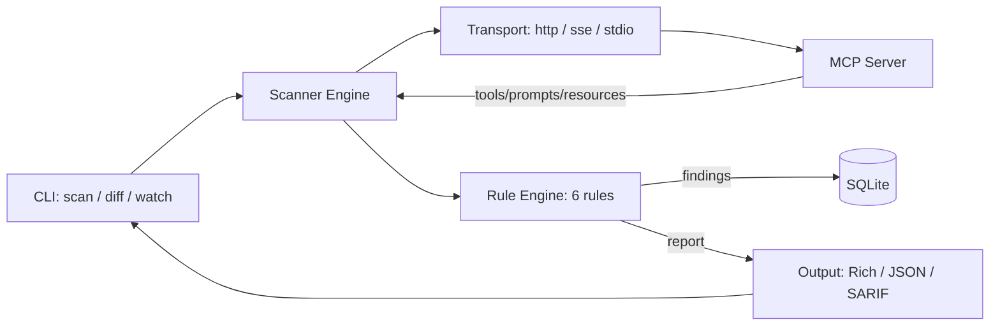

# MCPRadar

> **MCP server güvenlik tarayıcısı** — tool poisoning, prompt injection ve 
> supply-chain zaafiyetlerini tespit eder. CI/CD'nize drop-in entegre edin.

[](https://pypi.org/project/mcpradar/)
[](https://www.python.org/)
[](https://github.com/yatuk/mcpradar/actions/workflows/ci.yml)
[](https://codecov.io/gh/yatuk/mcpradar)
[](https://github.com/astral-sh/ruff)
[](LICENSE)


---

## Why?

MCP (Model Context Protocol) ekosistemi patlıyor — her geçen gün yüzlerce yeni 
MCP server'ı tool yayınlıyor. Peki bu tool'ların **gerçekte ne yaptığını** kim 
denetliyor?

> *"7.2% of MCP server tools are vulnerable to prompt injection attacks"* 
> — [arXiv:2506.13538](https://arxiv.org/abs/2506.13538), 2025

MCPRadar, MCP server'larınıza bağlanır, tool tanımlarını (name, description, 
input/output schema) tarar ve 6 güvenlik kuralından geçirir. Sonuçları 
**Rich tablo**, **JSON**, veya **SARIF** formatında alabilir, GitHub Actions'a 
entegre edebilirsiniz.

---

## Quick Start

```bash
uvx mcpradar scan "npx -y @modelcontextprotocol/server-filesystem /tmp" -t stdio
```

Tek satır. MCP server'ını tarar, bulguları gösterir, SQLite'a kaydeder.

---

## Features

- **6 detection rule** — OWASP LLM Top 10 ile uyumlu zero-width Unicode, 
  prompt injection, base64/hex blob, hidden HTML/Markdown, permission scope 
  mismatch, dangerous tool names
- **3 transport** — HTTP, SSE, stdio (herhangi bir MCP server'ı tara)
- **Snapshot-based diff** — İki tarama arasındaki farkı `git diff` style 
  görüntüle. Rug pull tespiti için ideal
- **SARIF output** — GitHub Security tab'ında bulguları gör. Drop-in 
  GitHub Action template
- **SQLite history** — Tüm taramalar timestamp'li saklanır. 
  `mcpradar diff <server>` ile değişiklik takibi
- **Extensible rules** — `Rule` base class'ından inherit al, 3 satırda 
  yeni kural ekle

---

## Comparison

| Feature | MCPRadar | mcp-scan | MCPSafetyScanner |
|---|---|---|---|
| Zero-width Unicode detection | ✅ | ❌ | ❌ |
| Prompt injection patterns | ✅ 10 patterns | ⚠️ basic | ✅ 3 patterns |
| Base64/hex blob detection | ✅ | ❌ | ❌ |
| Hidden HTML/Markdown | ✅ | ❌ | ❌ |
| Permission scope mismatch | ✅ | ❌ | ⚠️ |
| SARIF + GitHub Actions | ✅ | ❌ | ✅ |
| SQLite snapshot history | ✅ | ✅ | ❌ |
| Git-diff style diff | ✅ | ⚠️ | ❌ |
| stdio transport | ✅ | ✅ | ✅ |
| Python 3.11+ / pip / uvx | ✅ | ✅ | ✅ |
| Open source | MIT | MIT | Proprietary |

---

## How It Works



1. **Scanner** MCP server'a bağlanır (stdio/SSE/HTTP), `list_tools`, 
   `list_prompts`, `list_resources` çağrılarını yapar
2. **Rule Engine** her tool'u 6 kuraldan geçirir — name, description, 
   input/output schema alanlarını analiz eder
3. **Sonuç** Rich tablo, JSON veya SARIF olarak gösterilir, SQLite'a kaydedilir
4. **Diff** komutu iki snapshot arasındaki değişiklikleri `cosmetic`, 
   `behavioral`, veya `security` olarak sınıflandırır

---

## Installation

```bash
# uvx (no install needed)
uvx mcpradar scan http://localhost:8080

# pip
pip install mcpradar

# uv
uv pip install mcpradar

# Development
git clone https://github.com/yatuk/mcpradar
cd mcpradar
uv sync
```

---

## Usage

### Scan

```bash
# HTTP transport
mcpradar scan http://localhost:8080

# stdio transport (npx / uvx komutları)
mcpradar scan "npx -y @modelcontextprotocol/server-filesystem /tmp" -t stdio

# SSE transport
mcpradar scan sse://localhost:8080 -t sse

# SARIF output
mcpradar scan http://localhost:8080 --format sarif -o results.sarif

# Sadece critical bulgular
mcpradar scan http://localhost:8080 -s critical
```

### Diff

```bash
# Tüm taranan sunucuları listele
mcpradar diff

# Bir sunucunun son 2 snapshot'unu karşılaştır
mcpradar diff http://localhost:8080

# Belirli iki snapshot
mcpradar diff -a abc123 -b def456

# Tarihten beri değişiklikler
mcpradar diff http://localhost:8080 --since 2026-01-01
```

### Snapshot Browser

```bash
mcpradar list http://localhost:8080   # snapshot geçmişi
mcpradar show abc123                  # detaylı rapor
mcpradar export abc123 -f sarif -o out.sarif
mcpradar purge --older-than 30d --dry-run
```

### Watch & Config

```bash
# Periyodik izleme
mcpradar watch http://localhost:8080 -i 300 --alert-webhook https://hooks.slack.com/...

# Config'den tüm server'ları tara
mcpradar scan-all

# Yeni config oluştur
mcpradar init
```

---

## GitHub Action

```yaml
# .github/workflows/mcpradar.yml
- uses: actions/checkout@v4
- run: pip install mcpradar
- run: mcpradar scan ${{ vars.MCP_SERVER }} --format sarif -o results.sarif
- uses: github/codeql-action/upload-sarif@v3
  with:
    sarif_file: results.sarif
```

Daha detaylı template: [`.github/workflows/example-action.yml`](.github/workflows/example-action.yml)

---

## Detection Rules

| ID | Rule | Severity | Description |
|---|---|---|---|
| R001 | Dangerous Tool Name | CRITICAL | `eval`, `exec`, `rm`, `shell`, `curl`… |
| R101 | Zero-width Unicode | HIGH/CRITICAL | ZWSP, LRM, BOM — tool isminde CRITICAL |
| R102 | Prompt Injection | HIGH/CRITICAL | "ignore previous", "system:", `<\|im_start\|>`, "you must"… |
| R103 | Encoded Blob | MEDIUM/HIGH | Base64/hex blob → decode edilebilirse HIGH |
| R104 | Hidden Content | HIGH | `display:none`, `font-size:0`, hidden Markdown links |
| R105 | Scope Mismatch | LOW/MEDIUM | Tool ismi X, description Y'den bahsediyor |

Detaylı dökümantasyon: [docs/detection-rules.md](docs/detection-rules.md)

---

## Public Leaderboard

Popüler MCP server'larının güvenlik skorları: [validation/REPORT.md](validation/REPORT.md)

```bash
mcpradar registry-scan -o leaderboard.md
```

---

## Roadmap

- [x] 6 detection rule, 3 transport, SQLite snapshot
- [x] SARIF + GitHub Actions integration
- [x] Git-diff style diff (cosmetic / behavioral / security)
- [x] Snapshot browser (list, show, export, purge)
- [x] E2E tests with mock MCP server
- [x] CI matrix (3.11/3.12/3.13 × ubuntu/macos/windows)
- [ ] Real-world 10-server validation (in progress)
- [ ] Live dashboard (GitHub Pages)
- [ ] Plugin system for community rules
- [ ] MCP server fingerprinting
- [ ] Cross-server contamination analysis

---

## Contributing

Yeni bir detection rule eklemek 3 satır:

```python
class MyRule(Rule):
    rule_id = "R200"
    title = "My custom check"
    severity = Severity.HIGH

    def check(self, tool: ToolInfo) -> list[Finding]:
        ...
```

Detaylar: [docs/contributing.md](docs/contributing.md) ve 
[CONTRIBUTING.md](CONTRIBUTING.md)

---

## License

MIT — [LICENSE](LICENSE)

---

## Citation

```bibtex
@software{mcpradar2025,
  author = {MCPRadar Team},
  title = {MCPRadar: Security Scanner for MCP Servers},
  year = {2025-2026},
  url = {https://github.com/yatuk/mcpradar}
}
```
