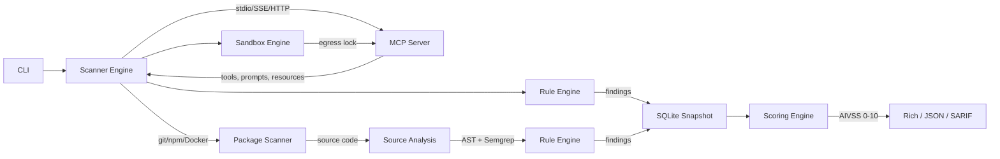

<!-- Logo: docs/logo-light.svg + docs/logo-dark.svg -->

<p align="center">
  <picture>
    <source media="(prefers-color-scheme: dark)" srcset="docs/logo-dark.svg">
    <source media="(prefers-color-scheme: light)" srcset="docs/logo-light.svg">
    
  </picture>
</p>

<h1 align="center">MCPRadar</h1>

<p align="center">
  <b>Security scanner for Model Context Protocol servers.</b><br/>
  Catch tool poisoning, prompt injection, and supply-chain rug pulls before your agent runs them.
</p>

<p align="center">
  <a href="https://github.com/yatuk/mcpradar/actions/workflows/ci.yml"></a>
  <a href="https://github.com/yatuk/mcpradar/blob/main/LICENSE"></a>
  <a href="https://github.com/yatuk/mcpradar"></a>
  <a href="https://github.com/yatuk/mcpradar"></a>
  <a href="https://github.com/yatuk/mcpradar"></a>
  <br/>
  <a href="https://pypi.org/project/mcpradar/"></a>
  <a href="https://pypi.org/project/mcpradar/"></a>
  <a href="https://pypi.org/project/mcpradar/"></a>
  <a href="https://github.com/astral-sh/ruff"></a>
  <a href="https://owasp.org/www-project-mcp-top-10/"></a>
</p>

<p align="center">
  <a href="#quick-start">Quick Start</a> ·
  <a href="#detection-rules">Detection Rules</a> ·
  <a href="#comparison">Comparison</a> ·
  <a href="#owasp-coverage">OWASP Coverage</a> ·
  <a href="#github-action">GitHub Action</a> ·
  <a href="ROADMAP.md">Roadmap</a> ·
  <a href="docs/architecture.md">Architecture</a>
</p>

---

## Why?

The Model Context Protocol ecosystem is growing fast — and so is its attack surface.

A 2025 study of **1,899 MCP servers** found that **7.2% contain general
vulnerabilities and 5.5% exhibit MCP-specific tool poisoning**
([arXiv:2506.13538](https://arxiv.org/abs/2506.13538)).
OX Security separately demonstrated remote code execution across
official MCP SDKs (Python, TypeScript, Java, Rust), with at least
10 high/critical CVEs.

The catch: traditional security tools don't watch MCP tool descriptions
or detect "rug pull" attacks where a server changes its tool schema
after install. **MCPRadar does.**

---

## Quick Start

```bash
uvx mcpradar scan "npx -y @modelcontextprotocol/server-filesystem /tmp" -t stdio
```

That's it. One command, no install, runs against any MCP server you can launch.

---

## Features

### 🔍 Security Detection (12 rules, all built)
- 🎯 **R001–R105** — Dangerous tool names, zero-width Unicode, prompt injection (10 patterns), base64/hex blobs, hidden HTML/Markdown, permission scope mismatch
- ✅ **R106–R111** — Secret/token exposure, command injection, supply chain risk, schema poisoning, version anomaly, insecure transport

### 🔗 Cross-Server Analysis (7 rules, all built)
- 🌐 **C001–C007** — Tool name collision, shadowing, exfiltration chains, capability overlap, permission gradient, attack path chain (graph-based), privilege escalation via cross-server chaining

### 📦 Package & Source Scanning
- 📂 **`scan-source`** — Scan GitHub repos, npm/pip packages, Docker images, MCP registry IDs without running the server
- 🌳 **AST + Semgrep** — Source-code static analysis: Description-Code Inconsistency (DCI), unsafe deserialization, SQLi

### 🏗️ CI/CD & Output
- 🔐 **SARIF v2.1.0** — drops into GitHub Security tab via one Action
- 📊 **AIVSS 0–10 scoring** — AI Vulnerability Severity Score with CWE mapping
- 📸 **Snapshot diff** — SQLite-backed history, *cosmetic / behavioral / **security*** classification
- 🏃 **Fast** — pure Python, no daemons, runs in CI under 5s

### 🔗 Supply Chain
- 📋 **CycloneDX SBOM** — export + OSV/GitHub Advisory CVE check (optional, async)
- 📌 **Hash-based tool pinning** — SHA-256 of description, schema, and command → rug pull detection
- 🔍 **Typosquatting detection** — Levenshtein distance against known top packages

### 🛡️ Enterprise
- 🏖️ **Sandbox mode** — `--sandbox`: disposable container with egress lock, ephemeral FS, cloud metadata block
- 📝 **Audit trail** — structured event logging (scan_start, finding_created, diff_detected)
- 📈 **Stats engine** — per-server trend analysis, top rules, severity distribution
- 🧩 **Plugin system** — `entry_points` auto-discovery, `mcpradar plugin init/validate/install`

---

## How It Works



MCPRadar connects to the MCP server (or pulls its source from GitHub/npm/Docker),
enumerates tools/prompts/resources, runs each tool schema through the rule engine,
performs AST+Semgrep-based source analysis when available, computes AIVSS scores,
stores the snapshot in SQLite, and outputs the report. Subsequent scans diff against
history to catch silent changes. The optional sandbox engine runs untrusted STDIO
servers in disposable containers with network egress locked down.

---

## Comparison

Feature presence in MCP security tools. **Feature checkmarks do not imply detection accuracy** —
see [Benchmarks](#benchmarks) for measured precision/recall data.

| Feature | MCPRadar | Cisco mcp-scanner | Snyk agent-scan | Pipelock | Hermes | agent-audit | MCP Guardian |
|---|---|---|---|---|---|---|---|
| **Approach** | Static + Diff + Sandbox | YARA + LLM + VirusTotal | LLM classifier | Runtime proxy (Go) | Fuzz + Probe (Rust) | SAST 40+ rules | Policy proxy |
| **Zero-width Unicode** | ✅ | — | — | ✅ | — | — | — |
| **Prompt injection** | 10 patterns | YARA patterns | LLM-based | ✅ | — | — | — |
| **Base64/hex blob** | ✅ | — | — | ✅ | — | — | — |
| **Hidden HTML/MD** | ✅ | — | — | ✅ | — | — | — |
| **Secret/token scan** | ✅ | ✅ | — | ✅ | ✅ | ✅ | — |
| **Command injection** | ✅ | — | — | ✅ | ✅ | ✅ | — |
| **Supply chain risk** | ✅ | — | — | — | — | ✅ | — |
| **DCI (desc ≠ code)** | ✅ | — | — | — | — | Partial | — |
| **Cross-server analysis** | ✅ C001-C007 | — | — | — | — | — | — |
| **Source scanning** | ✅ GitHub/npm/Docker | — | — | — | — | ✅ | — |
| **SBOM + dep. CVE** | ✅ CycloneDX | — | — | — | — | — | — |
| **Sandbox execution** | ✅ Docker egress-lock | — | — | N/A (proxy) | — | — | — |
| **AIVSS scoring** | ✅ 0–10 + CWE | LLM score | ✅ | — | — | — | — |
| **Snapshot diff** | ✅ 3-level | Not documented | Version compare | ✅ | — | — | — |
| **SARIF output** | ✅ v2.1.0 | ✅ | — | — | ✅ | — | — |
| **stdio transport** | ✅ | — | — | — | — | — | — |
| **Runtime proxy** | 🔜 planned v1.1 | — | — | ✅ | — | — | ✅ |
| **License** | MIT | Apache 2.0 | Snyk platform | Apache 2.0 | Unknown | Unknown | Custom |
| **Offline capable** | ✅ | — (VT/LLM API) | — (LLM API) | ✅ | ✅ | ✅ | ✅ |
| **Accuracy measured?** | ✅ [BENCHMARK](validation/BENCHMARK.md) | Not published | Not published | Not published | Not published | [0.91 F1](https://explore.market.dev/ecosystems/mcp/projects/agent-audit) | Not published |

✅ = Feature present  ·  🔜 = Planned  ·  — = Unknown / not independently verified

**Note:** `—` means we could not verify the feature's existence or accuracy from public documentation.
This does NOT mean the tool lacks the capability — only that we have no data to confirm it.
Corrections welcome via PR.

---

## Benchmarks

MCPRadar's detection accuracy is measured against a labeled corpus and published
in [`validation/BENCHMARK.md`](validation/BENCHMARK.md). The benchmark includes:

- **Positive cases:** `demo/malicious_server.py` — 9 intentionally vulnerable tools covering R001–R109
- **Negative controls:** Official MCP reference servers (filesystem, memory, everything) — expected zero findings
- **External corpus:** [Appsecco Vulnerable MCP Servers Lab](https://github.com/appsecco/vulnerable-mcp-servers-lab) — 9 servers with labeled vulnerability classes

| Metric | Target |
|---|---|
| Precision | ≥ 80% |
| Recall | ≥ 85% |
| F1 Score | ≥ 0.82 |

Performance benchmarks (see `tests/test_benchmark.py`): rule engine latency ~14 ms (100 tools),
SARIF generation ~2 ms (100 findings), SQLite insert ~1.5 ms (batch).

---

## Known Limitations

MCPRadar is a **pattern detector, not an exploitability oracle**. It does not execute
code or exploit vulnerabilities. Understand its limits:

| Rule | Detection Method | FP Risk | Notes |
|---|---|---|---|
| R102 (Prompt injection) | Regex patterns | Medium | "You must..." in docs, "system:" in OS references |
| R105 (Scope mismatch) | Heuristic word overlap | **High** | Legitimate bridge/adapter tools; allowed via BRIDGE_KEYWORDS |
| R106 (Secrets) | Pattern + entropy | Medium | Placeholder keys, example tokens, high-entropy IDs |
| R107 (Command injection) | Shell metachar sequences | Medium | Build scripts, command examples in documentation |
| R108 (Supply chain) | Install/exec patterns | **High** | `pip install`, `npx`, `eval(` in setup instructions |

For detailed triage guidance, see [`docs/false-positives.md`](docs/false-positives.md).

**What MCPRadar does NOT do:**
- Execute or validate exploitability of detected patterns
- Detect runtime-only attacks on live traffic (use a runtime proxy for that)
- Guarantee zero false negatives — novel attack patterns may evade static rules

---

## Installation

```bash
# No install needed — one-shot
uvx mcpradar scan http://localhost:8080

# Or install permanently
pip install mcpradar
```

---

## Usage

```bash
# Scan a local stdio server
mcpradar scan stdio -- npx -y @modelcontextprotocol/server-filesystem /tmp

# Scan an HTTP server, only critical findings
mcpradar scan http://localhost:8080 -s critical

# SARIF for CI
mcpradar scan http://x --format sarif -o results.sarif

# Diff last 2 scans (rug pull detection)
mcpradar diff http://localhost:8080

# Scan a GitHub repo without running the server
mcpradar scan-source github:user/mcp-server

# Scan an npm/pip package statically
mcpradar scan-source npm:mcp-server-package
mcpradar scan-source pip:mcp-server-lib

# Safe sandboxed execution (disposable container, no network)
mcpradar scan stdio -- ./untrusted-server --sandbox

# Plugin management
mcpradar plugin init my-rule
mcpradar plugin validate ./my-rule
mcpradar plugin list

# Runtime probing (safe read-only tools only)
mcpradar probe http://localhost:8080 --safe-only

# Server fingerprinting
mcpradar fingerprint http://localhost:8080

# Cross-server deep analysis
mcpradar analyze-context --deep --graph -o risk.dot

# Audit trail and statistics
mcpradar audit --target http://localhost:8080
mcpradar stats http://localhost:8080
```

---

## GitHub Action

```yaml
- name: Scan MCP server
  run: uvx mcpradar scan ${{ inputs.server }} --format sarif -o results.sarif

- uses: github/codeql-action/upload-sarif@v3
  with:
    sarif_file: results.sarif
```

Findings appear in your repo's Security tab. Full template:
[`.github/workflows/example-action.yml`](.github/workflows/example-action.yml)

---

## Detection Rules

### Built-in (v1.0)

| ID   | Rule                  | Severity      | OWASP | Catches |
|------|-----------------------|---------------|-------|---------|
| R001 | Dangerous Tool Name   | CRITICAL      | MCP03 | `eval`, `exec`, `rm`, `shell`, `curl`, `wget`, `chmod` … |
| R101 | Zero-Width Unicode    | HIGH/CRITICAL | MCP06 | ZWSP, LRM, RLO, BOM — in tool name (CRITICAL) or description (HIGH) |
| R102 | Prompt Injection      | HIGH/CRITICAL | MCP06 | "ignore previous", `system:`, `<\|im_start\|>`, "you must", override, jailbreak … (10 patterns) |
| R103 | Encoded Blob          | MEDIUM/HIGH   | MCP06 | Base64 (40+ chars), hex (32+ chars) — HIGH if decodes to readable text |
| R104 | Hidden Content        | HIGH          | MCP03 | `display:none`, `font-size:0`, hidden Markdown links, deceptive `<a>` tags |
| R105 | Scope Mismatch        | LOW/MEDIUM    | MCP02 | Tool name implies file/db/read-only, description mentions network/shell/write |
| R106 | Secret/Token Exposure | CRITICAL/HIGH | MCP01 | API keys, GitHub tokens, JWTs, DB connection strings, high-entropy strings |
| R107 | Command Injection     | CRITICAL/HIGH | MCP05 | Shell metacharacters, dangerous defaults, overly broad regex, command enums |
| R108 | Supply Chain Risk     | HIGH/MEDIUM   | MCP04 | `curl \| bash`, `pip install`, `eval()`, `npx`, dynamic imports |
| R109 | Schema Poisoning      | HIGH/MEDIUM   | MCP03 | `additionalProperties: true`, missing types, excessive maxLength/maxItems |
| R110 | Version Anomaly       | HIGH/CRITICAL | MCP09 | Version rollback, major upgrade, tool list change, TLS downgrade |
| R111 | Insecure Transport    | HIGH/CRITICAL | MCP07 | Plain HTTP, TLS < 1.2, expired/self-signed certs, missing HSTS |

### Cross-Server (v0.5.0)

| ID   | Rule                  | Severity      | OWASP | Catches |
|------|-----------------------|---------------|-------|---------|
| C001 | Tool Name Collision   | CRITICAL      | MCP10 | Same tool name exposed by 2+ servers — LLM may call wrong one |
| C002 | Tool Name Shadowing   | HIGH          | MCP10 | Similar tool names across servers (≥75% similarity) |
| C003 | Exfiltration Chain    | CRITICAL      | MCP10 | Server A reads sensitive data, Server B sends it out |
| C004 | Capability Overlap    | MEDIUM        | MCP10 | 3+ servers exposing same capability (file_read, shell_exec…) |
| C005 | Permission Gradient   | MEDIUM        | MCP02 | Read-only + write-capable server mix — injection may hijack write access |
| C006 | Attack Path Chain     | CRITICAL/HIGH/MEDIUM | MCP03/MCP10 | Schema type matching across server tool outputs and inputs reveals chained attack paths |
| C007 | Privilege Escalation  | CRITICAL      | MCP02 | Read-only tool output on server A feeds into write/exec tool input on server B |

Full docs: [docs/detection-rules.md](docs/detection-rules.md)

---

## Public Leaderboard

Security scores for popular MCP servers, updated weekly:

<p align="center">
  <a href="https://yatuk.github.io/mcpradar"><b>🔗 yatuk.github.io/mcpradar</b></a>
</p>

---

<p align="center">
  <br/>
  <b>⭐ If MCPRadar helped you catch something, please star us on GitHub.</b><br/>
  <sub>It's the single biggest signal that this work matters.</sub>
  <br/><br/>
  <a href="https://github.com/yatuk/mcpradar">
    
  </a>
</p>

---

## OWASP MCP Top 10 Coverage

MCPRadar targets full coverage of the [OWASP MCP Top 10 (2025)](https://owasp.org/www-project-mcp-top-10/):

| # | Risk | Covered By | Status |
|---|---|---|---|
| MCP01 | Token Mismanagement & Secret Exposure | R106 | ✅ Strong |
| MCP02 | Privilege Escalation via Scope Creep | R105, C005, C007 | 🟢 Strong |
| MCP03 | Tool Poisoning | R001, R104, R109, C006 | 🟢 Strong |
| MCP04 | Supply Chain Attacks & Dependency Tampering | R108 | ✅ Strong |
| MCP05 | Command Injection & Execution | R001, R107 | 🟢 Strong |
| MCP06 | Prompt Injection via Contextual Payloads | R101, R102, R103, R104 | ✅ Strong |
| MCP07 | Insufficient AuthN/AuthZ | R111 | ✅ Strong |
| MCP08 | Lack of Audit & Telemetry | Audit trail, Stats engine | ✅ Strong |
| MCP09 | Shadow MCP Servers | R110 | ✅ Strong |
| MCP10 | Context Injection & Over-Sharing | C001–C007 | 🟢 Strong |

✅ Strong · 🟡 Partial · 🔴 Minimal · 🔜 Planned — see [ROADMAP.md](ROADMAP.md)

---

## Claude Code Agent Team

MCPRadar's development is powered by 12 specialized subagents under `.claude/agents/`:

| Agent | Expertise |
|---|---|
| `detection-rule-engineer` | New Rule subclasses (R200+), severity classification, false-positive reduction |
| `source-analysis-engineer` | Python `ast` + Semgrep for SSRF, path traversal, DCI, unsafe deserialization |
| `transport-specialist` | HTTP/SSE/stdio transport layer, MCP handshake, connection errors |
| `auth-hardening-auditor` | OAuth 2.1 anti-pattern, token passthrough, 0.0.0.0 bind, hardcoded credentials |
| `supply-chain-analyst` | CycloneDX SBOM, OSV/GitHub Advisory, typosquatting, hash pinning |
| `package-source-scanner` | GitHub/npm/pip/Docker/registry source fetching, scan without running |
| `sandbox-runtime-engineer` | Disposable container, egress lock, ephemeral FS |
| `diff-snapshot-dev` | SQLite schema, diff classification (cosmetic/behavioral/security) |
| `scoring-fp-engineer` | AIVSS 0–10 scoring, CWE mapping, confidence-based FP reduction |
| `ci-sarif-engineer` | SARIF output, GitHub Actions, CI matrix, OIDC PyPI publish |
| `test-qa` | Pytest coverage, fixtures, regression, per-rule case tables |
| `docs-maintainer` | README, CHANGELOG, docs/ synchronization |

---

## Roadmap

See **[ROADMAP.md](ROADMAP.md)** for the full development roadmap.

### Summary

| Sprint | Version | Focus |
|--------|---------|-------|
| ✅ 1 | v0.2.0 | 4 new rules — Secret exposure (R106), Command injection (R107), Supply chain (R108), Schema poisoning (R109) |
| ✅ 2 | v0.3.0 | Plugin system — PluginManager, Validator, Scaffolder, CLI |
| ✅ 3 | v0.4.0 | Server fingerprinting + Transport security (R110, R111) |
| ✅ 4 | v0.5.0 | Deep cross-server analysis + Runtime probing (C006, C007) |
| 5 | v0.6.0 | Audit trail + CVE automation + Statistics |
| ✅ 6 | v1.0.0-rc1 | Validation, performance, documentation — OWASP 10/10 |

### Completed (v0.1.0)

- [x] 6 detection rules, 3 transports, SQLite snapshot
- [x] Git-diff style schema diff (cosmetic/behavioral/security)
- [x] Snapshot browser (list, show, export, purge)
- [x] SARIF + GitHub Actions integration
- [x] CI matrix (3.11/3.12/3.13 × ubuntu/macos/windows)
- [x] Public leaderboard (GitHub Pages)

---

## Contributing

Adding a new detection rule is 3 lines:

```python
class MyRule(Rule):
    rule_id = "R200"
    title = "My custom check"
    severity = Severity.HIGH

    def check(self, tool: ToolInfo) -> list[Finding]:
        ...
```

See [CONTRIBUTING.md](CONTRIBUTING.md) and
[docs/contributing.md](docs/contributing.md) for details.

---

## Star History

<a href="https://www.star-history.com/#yatuk/mcpradar&Date">
 <picture>
   <source media="(prefers-color-scheme: dark)" srcset="https://api.star-history.com/svg?repos=yatuk/mcpradar&type=Date&theme=dark" />
   <source media="(prefers-color-scheme: light)" srcset="https://api.star-history.com/svg?repos=yatuk/mcpradar&type=Date" />
   
 </picture>
</a>

---

## Contributors

<a href="https://github.com/yatuk/mcpradar/graphs/contributors">
  
</a>

---

## License

[MIT](LICENSE) © 2026 Fatih Serdar Çakmak
