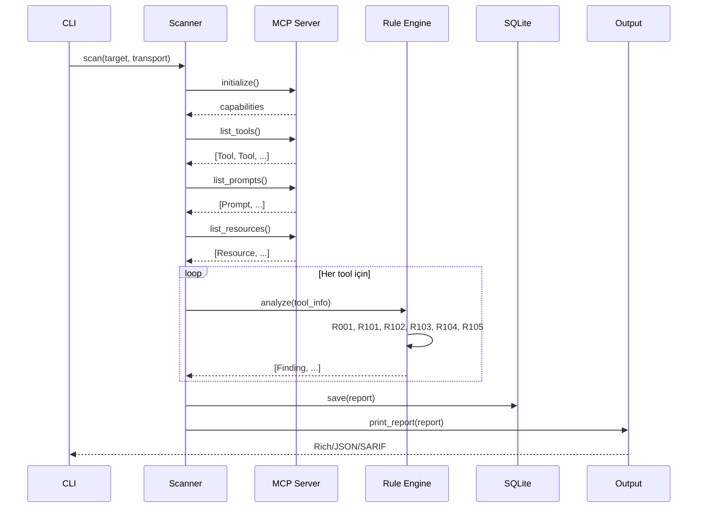

# Architecture

MCPRadar kod tabanı turu.

## Directory Structure

```
mcpradar/
├── src/mcpradar/
│   ├── __main__.py            # python -m entry, UTF-8 enforcement
│   ├── cli.py                 # Typer CLI: scan, diff, watch, list, show, ...
│   ├── config.py              # mcpradar.toml reader (MCPRadarConfig)
│   │
│   ├── scanner/               # Core scanning pipeline
│   │   ├── engine.py          # Scanner class: transport + data collection
│   │   ├── rules.py           # 6 detection rules (Rule base class)
│   │   └── report.py          # Data models (ScanReport, Finding, ToolInfo)
│   │
│   ├── diff/
│   │   └── differ.py          # Schema-aware comparison + change severity
│   │
│   ├── watch/
│   │   └── watcher.py         # Periodic scan + alert (webhook/cmd)
│   │
│   ├── output/
│   │   ├── console.py         # Rich tables, git-diff style diff
│   │   └── sarif.py           # SARIF v2.1.0 converter
│   │
│   ├── storage/
│   │   └── store.py           # SQLite: scans, tools, prompts, resources, findings
│   │
│   ├── init/
│   │   └── initializer.py     # mcpradar.toml template generator
│   │
│   └── registry/
│       └── scanner.py         # Known registry leaderboard
│
├── tests/
│   ├── conftest.py            # (future: fixtures)
│   ├── test_rules.py          # 36 unit tests for detection rules
│   ├── test_diff.py           # 9 tests for Differ + change severity
│   ├── test_scanner.py        # RuleEngine + ScanReport tests
│   ├── test_sarif.py          # SARIF output tests
│   ├── test_watch.py          # SQLite Store tests
│   ├── test_e2e.py            # Memory-stream MCP protocol E2E
│   └── mock_server.py         # In-memory malicious MCP server
│
├── validation/
│   ├── targets.yaml           # 10 real-world server definitions
│   ├── run_validation.py      # Auto-scan + triage + report generator
│   └── results/               # Per-server JSON results
│
├── docs/                      # Deep-dive documentation
├── .github/workflows/         # CI (matrix) + release + example action
└── pyproject.toml
```

## Data Flow



## Key Design Decisions

### Rule Plugins

Her rule `Rule` base class'ından inherit alır. Yeni kural eklemek için:
1. `Rule` subclass'ı oluştur
2. `rule_id`, `title`, `severity` belirle
3. `check(tool) -> list[Finding]` implement et
4. `RuleEngine.__init__`'e `self._rules.append(MyRule())` ekle

Kurallar birbirinden bağımsızdır, paralel çalıştırılabilir.

### Transport Abstraction

Scanner 3 transport destekler:
- **stdio:** `StdioServerParameters` → `stdio_client()`
- **sse:** URL dönüştürme → `sse_client()`
- **http:** direkt → `streamablehttp_client()`

Her transport `(read_stream, write_stream)` tuple'ı üretir. `ClientSession` 
transport-agnostiktir.

### SQLite Schema

```
scans(id, target, transport, scanned_at, summary)
tools(scan_id FK, name, description, input_schema, output_schema)
prompts(scan_id FK, name, description, arguments)
resources(scan_id FK, uri, name, description, mime_type)
findings(scan_id FK, rule_id, title, description, severity, target, location, evidence, detail)
```

Design: flat tables, JSON-serialized complex fields (input_schema, detail). 
Indexed by scan_id + target + scanned_at. WAL mode.

### Diff Severity Classification

```
description change → run R102+R104 on new text
                    → triggered? → SECURITY
                    → clean? → COSMETIC

input_schema change → walk properties
                      → security-sensitive key added? → SECURITY
                      → type/format change? → BEHAVIORAL
```
